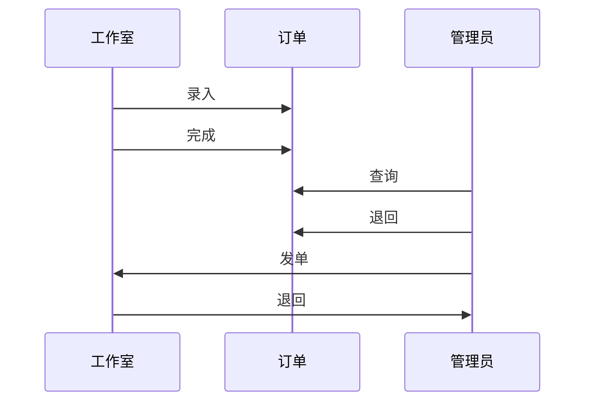

#《游戏代练系统》需求分析

> 现游戏代练下单至结束对订单的监控、跟踪。

## 用户角色

1. 录入员
   实现订单录入功能
2. 管理员
   订单管理
3. 工作室
   接单、完成订单

## 系统流程图


## 需求分析

1. 录入员
   - 需求：**实现订单录入功能**
   - 实现：
       字段  |  类型 |	 备注
       :---: | :--- :| :---: |
      游戏名称 |	下拉框 	|游戏名称可以自定义
      订单店铺 |	 同上 	|   同上
     天猫订单号 |	 文本 |
     天猫订单金额|	浮点型 |
      游戏账号 	| 文本|
      游戏密码 	| 同上|
      角色名  | 同上|
      联系电话 | 同上|
      代练要求 	| 同上|
       备注  	| 同上|

   - 流程图：

   ```mermaid
   graph TD;
       A[开始] --> |登录|B{是否登录};
       B --> |否|A[开始];
       B --> |是|C[录入];
       C --> |上传|D[结束];
   ```
   
2. 管理员
   - 需求：**实现订单跟踪管理功能**
   - 实现：
    1).  订单查询
     字段  |  类型 | 备注
       :---: | :--- :| :---: |
      订单状态 |	下拉框 | 录单、发单、工作室已接单、工作室退回
      天猫订单号 |	 文本 	|
     天猫订单金额|	浮点型 |
      游戏账号 	| 文本|
      游戏密码 	| 同上|
      角色名  | 同上|
      联系电话 | 同上|
      代练要求 	| 同上|
       备注  	| 同上|
    2).  订单退回
      字段  |  类型 | 备注
       :---: | :--- :| :---: |
      退回原因 |	下拉框 | 账号原因、无法完成
      备注 | 文本 | 录入备注信息
3. 工作室
   - 需求：**接收/完成订单**
   - 实现：
   1). 接单
     字段  |  类型 | 备注
       :---: | :--- :| :---: |
      游戏名 |	文本 |
      发单价格 | 浮点数 |
      代练要求 	| 文本|
       备注  	| 同上|
   2). 订单查询
   	 字段  | 类型 | 备注
      :---: | :--- :| :---:
     游戏名称 |文本 |
     天猫订单号 |文本 |
     游戏账号 | 文本|
     游戏密码 | 同上|
     角色名  | 同上|
     联系电话 | 同上|
     代练要求 | 同上|
     备注 | 同上|
   3). 订单退回
      字段  |  类型 | 备注
       :---: | :--- :| :---: |
      退回原因 |	下拉框 | 账号原因、无法完成
      备注 | 文本 | 录入备注信息

## 预算
项目 | 时间 | 备注 |
:---: | :---: | :---: |
需求分析 | 16h |
数据库设计 | 8h |
UI设计 | 8h |
接口设计 | 24h |
前端代码编写 | 32h |
测试上线 | 8h |
合计 | 96h |

估算金额：3200 // = 33 * 96